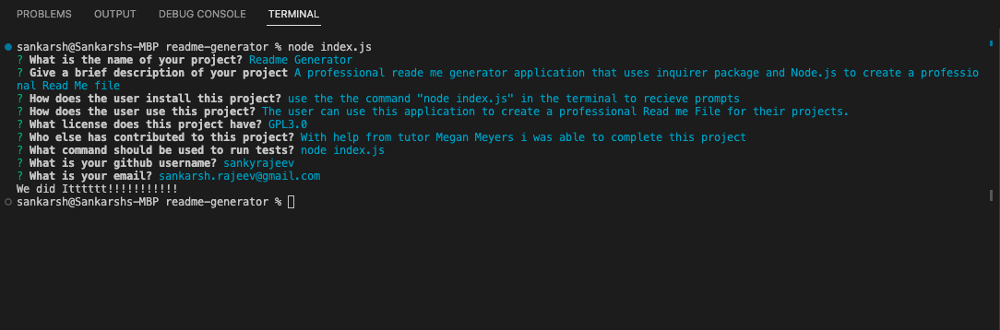
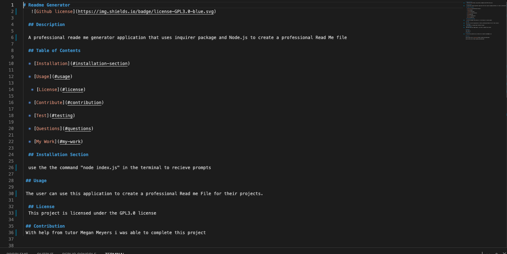

# ReadMe-Generator

## Description

This project is a command-line readMe file generator application. Using node and inquirer the user is prompted with questions, the Javascript files take in the users answers and generate a readme file. I learned how to install the command-line interface Inquirer using node by typing in "npm install inquirer".

## Installation

### Installations required

-node
-inquirer

## Usage

Using an instance of terminal that is integrated with the index.js file the user starts the application by typing "node index". This will prompt the user with questions. The answers will be inserted into the dynamically created readme file.

## Link to video

https://drive.google.com/file/d/1Hy1TKwpEwKhi6DtN4oDGI1Zg1LcvU6yG/view

## Screenshots
    
  

  

  
    